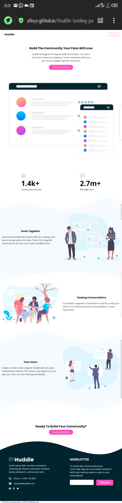

# Frontend Mentor - Huddle landing page with curved sections solution

This is a solution to the [Huddle landing page with curved sections challenge on Frontend Mentor](https://www.frontendmentor.io/challenges/huddle-landing-page-with-curved-sections-5ca5ecd01e82137ec91a50f2). Frontend Mentor challenges help you improve your coding skills by building realistic projects. 

## Table of contents

- [Overview](#overview)
  - [The challenge](#the-challenge)
  - [Screenshot](#screenshot)
  - [Links](#links)
- [My process](#my-process)
  - [Built with](#built-with)
  - [What I learned](#what-i-learned)
  - [Continued development](#continued-development)
- [Author](#author)

## Overview

### The challenge

Users should be able to:

- View the optimal layout for the site depending on their device's screen size
- See hover states for all interactive elements on the page

### Screenshot




### Links

- Solution URL: [https://www.frontendmentor.io/solutions/huddle-landing-page-2PEG6Wryzf](https://www.frontendmentor.io/solutions/huddle-landing-page-2PEG6Wryzf)
- Live Site URL: [https://alloyc.github.io/Huddle-landing-page/](https://alloyc.github.io/Huddle-landing-page/)

## My process

### Built with

- Semantic HTML5 markup
- CSS custom properties
- Flexbox
- CSS Grid
- Mobile-first workflow


### What I learned

learnt about veiwBox and curved sections and organize css code.
Also how to use font awesome icons


```html
  <script
      src="font awesome kit link"
      crossorigin="anonymous"
    ></script>
  <i class="fa-brands fa-facebook"></i>
```

### Continued development
I'll love to learn more about svgs to help me understand and better use them in projects like this

## Author

- Frontend Mentor - [@AlloyC](https://www.frontendmentor.io/profile/AlloyC)
- Twitter - [@jonnyAlloy](https://www.twitter.com/jonnyAlloy)
